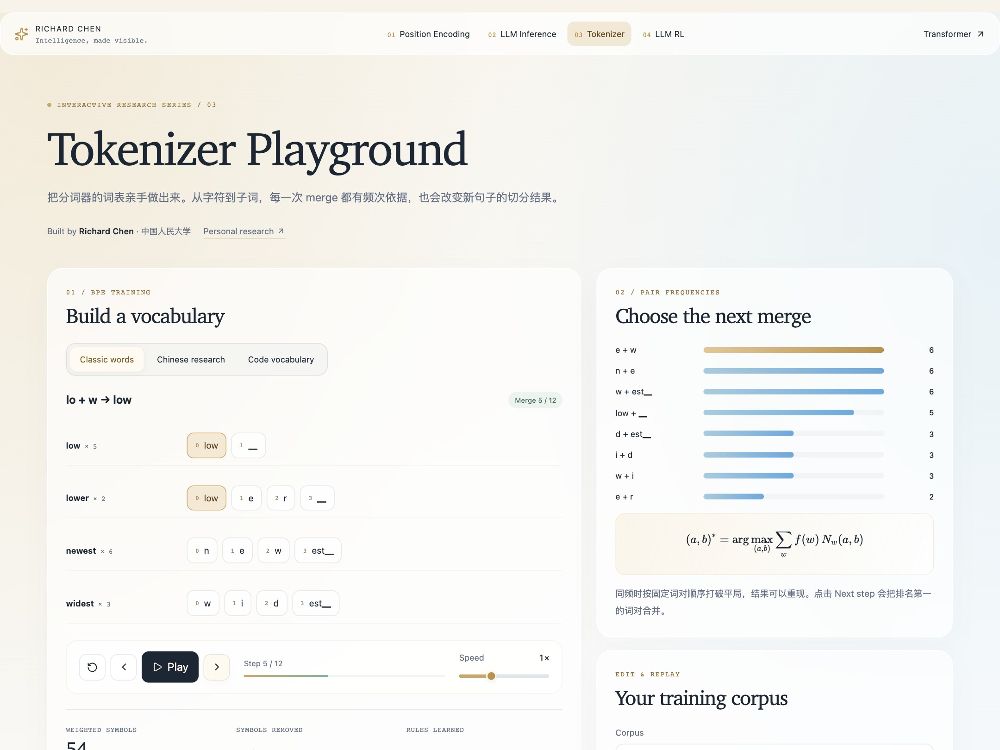
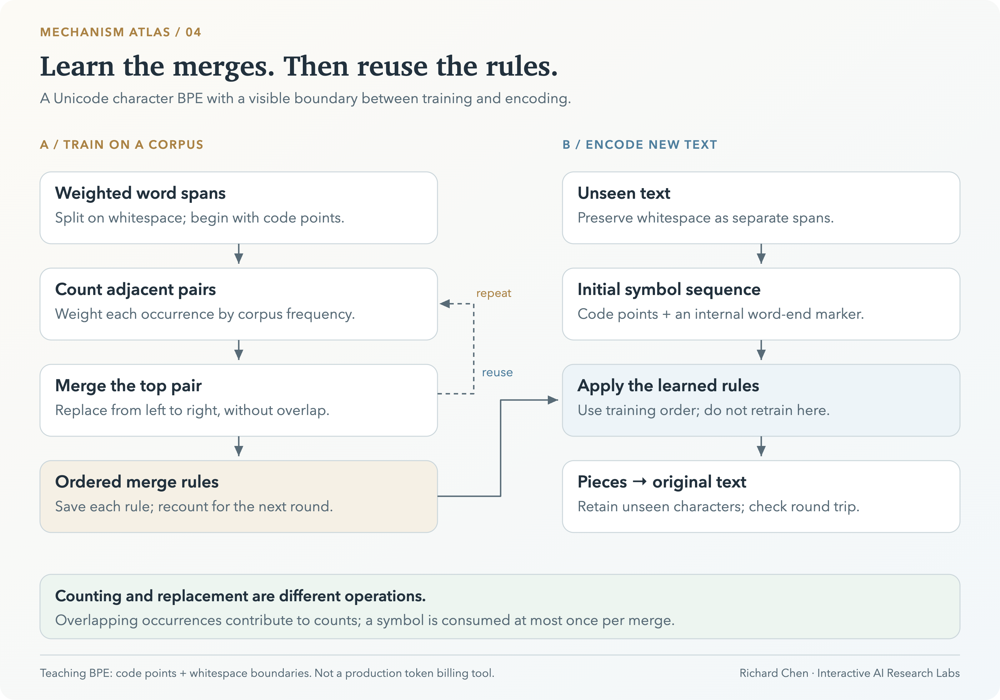
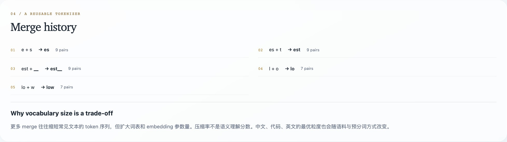
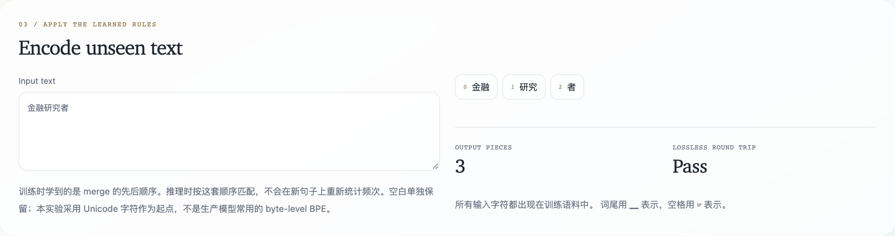

# Tokenizer Playground

**看一个词表，如何从一次次合并中生长。**

亲手训练一个小型 Unicode character BPE，检查每次 merge 背后的频次，再把学到的规则用于新文本。英文、中文、代码词汇与自定义语料，都通过同一套可观察的算法。

[**进入实验室 ↗**](https://richardchen99.github.io/tokenizer-playground/) · [配套研究笔记](https://richardchen99.github.io/blog/tokenizer-playground-note/) · [English README](README.md) · [本地运行](#本地运行)

作者：**Richard Chen · 中国人民大学 / Renmin University of China** · [个人主页](https://richardchen99.github.io)

[](https://richardchen99.github.io/tokenizer-playground/)

*真实运行截图。语料频次解释下一次合并，规则顺序解释之后的新文本分词。*

## 从频次到可复用规则

| 实验 | 操作 | 可以观察到什么 |
| --- | --- | --- |
| **Vocabulary construction** | 播放、暂停或回退 | 字符如何逐步变成长片段 |
| **Pair frequencies** | 查看最高频的八个词对 | 为什么这一步选择这个 merge |
| **Custom corpus** | 编辑至多 1,200 字符与合并预算 | 训练分布怎样改变词表 |
| **Unseen text** | 使用当前已学规则编码 | 哪些片段能迁移到新词 |
| **Round-trip check** | 输入空格、换行或 emoji | 是否精确还原原始输入 |

三组预设包括 **Classic words**（`low / lower / newest / widest`）、**Chinese research**（`研究 / 研究者 / 金融研究 / 决策智能`）与 **Code vocabulary**（`token / tokenization / encoder / decoder`）。界面采用英文控件与中文解释。

## 算法框架



*原创框架图：训练产生有序规则表，编码复用规则而不重新学习频次。[可编辑 SVG](docs/assets/architecture.svg) · [图片来源与状态](docs/assets/README.md)。*

## 复现前五次合并

1. 选择 **Classic words**，逐步执行五次 merge。
2. 查看历史：依次为 `e + s`（9）、`es + t`（9）、`est + </w>`（9）、`l + o`（7）、`lo + w`（7）。
3. 在 **Input text** 输入 `lowest newer`，切换训练步数，观察某个片段何时成为可用规则。
4. 切换 **Chinese research**，六次 merge 后，`金融研究者` 被切分为 `金融 / 研究 / 者`。
5. 尝试自定义语料 `aaa aaa aa a`：词对统计包含重叠位置，实际替换从左向右进行且不重叠。

括号中的数字是选择该规则时的加权词对频次，不简单等于这条规则执行的替换次数。

<details>
<summary><strong>展开合并历史与中文分词截图</strong></summary>



*规则同时保留训练顺序与选择时的频次。*



*新文本复用训练片段，还原检查保留原始输入。*

</details>

## 数学机制与实现范围

训练选择加权频次最高的相邻符号对：

$$
(a,b)^*=\arg\max_{(a,b)}\sum_w f(w)N_w(a,b).
$$

$f(w)$ 是词在语料中的频次，$N_w(a,b)$ 是当前符号序列中相邻词对的出现次数，包含重叠位置。选中后执行从左向右、非重叠的替换，再重新统计频次。同频情况使用固定英语 locale 的排序规则。

编码按**训练得到的有序规则**逐项执行，不在新句子中重新统计词对。空白独立保留，未见字符保留原字符，以便无损还原。

这是以 **Unicode code point** 起步、空白预分词、带内部 `</w>` 标记的教学 BPE，不复现 GPT byte-level BPE、SentencePiece 或任何生产模型 tokenizer。输出 token 数不能用来估算线上模型计费；保留标记 `</w>` 禁止出现在训练输入中。

## 本地运行

推荐 **Node.js 24**，最低支持 22.12。

```bash
git clone https://github.com/richardchen99/tokenizer-playground.git
cd tokenizer-playground
npm ci
npm run dev -- --host 127.0.0.1
```

```bash
npm test
npm run build
npm run preview -- --host 127.0.0.1
```

训练与编码在浏览器内完成，无需模型服务、API 密钥或 GPU。技术栈为 React 19、TypeScript、Vite、Framer Motion 与 KaTeX。

## 实现与验证

| 入口 | 重点 |
| --- | --- |
| [`src/model.ts`](src/model.ts) | 词频、词对统计、合并、编码与显示映射 |
| [`src/App.tsx`](src/App.tsx) | 语料编辑、训练状态、规则历史与新文本实验 |
| [`src/shared.tsx`](src/shared.tsx) · [`src/style.css`](src/style.css) | Token 动画、公式、玻璃面板与 reduced-motion 支持 |
| [`tests/model.test.mjs`](tests/model.test.mjs) | 加权频次、重叠行为、符号减少、Unicode/空白还原与空输入 |

`npm test` 编译模型后运行 Node test runner。[Pages 工作流](.github/workflows/deploy.yml) 使用 Node 24 测试、类型检查、构建并部署 `main`。Fork 后，将 Pages source 设为 **GitHub Actions** 即可部署。

## 阅读与引用

- Sennrich 等：[Neural Machine Translation of Rare Words with Subword Units](https://arxiv.org/abs/1508.07909)，2015 预印本，BPE 子词切分。
- Kudo 与 Richardson：[SentencePiece](https://arxiv.org/abs/1808.06226)，2018，可对照阅读的不同输入处理设计。
- Hugging Face：[Tokenizers](https://huggingface.co/docs/tokenizers/index)，生产 tokenizer 的组件与流程。
- [配套研究笔记](https://richardchen99.github.io/blog/tokenizer-playground-note/)，中文实验导读。

用于课程或文章时，可链接本仓库并记录所用 commit。[CITATION.cff](CITATION.cff) 提供机器可读的软件署名信息。

## 系列实验室

| 项目 | 核心问题 |
| --- | --- |
| **Tokenizer Playground** | 语料怎样变成可复用词表？ |
| [Transformer Architecture Lab](https://github.com/richardchen99/transformer-architecture-lab) | Attention 怎样把 token 表示转为上下文？ |
| [Position Encoding Lab](https://github.com/richardchen99/position-encoding-lab) | 位置怎样改变注意力几何？ |
| [LLM Inference Lab](https://github.com/richardchen99/llm-inference-lab) | 什么条件下可以复用历史计算？ |
| [LLM RL Lab](https://github.com/richardchen99/llm-rl-lab) | 奖励怎样改变回答分布？ |

如果它对你的学习或教学有帮助，欢迎点亮 Star。能够揭示有趣合并行为的小型语料，尤其适合作为贡献。
